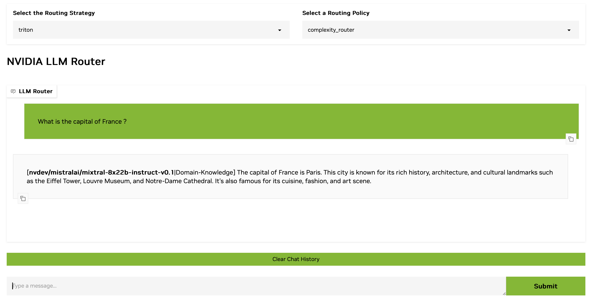

# LLM Router Playground Application 

This web application makes it easy to try out LLM Router with different prompts and policy/model configurations. To run the app:
- run `make up` to start the LLM router services
- run `make app` to start the web application 

Navigate to `localhost:8008` to view the web app.

