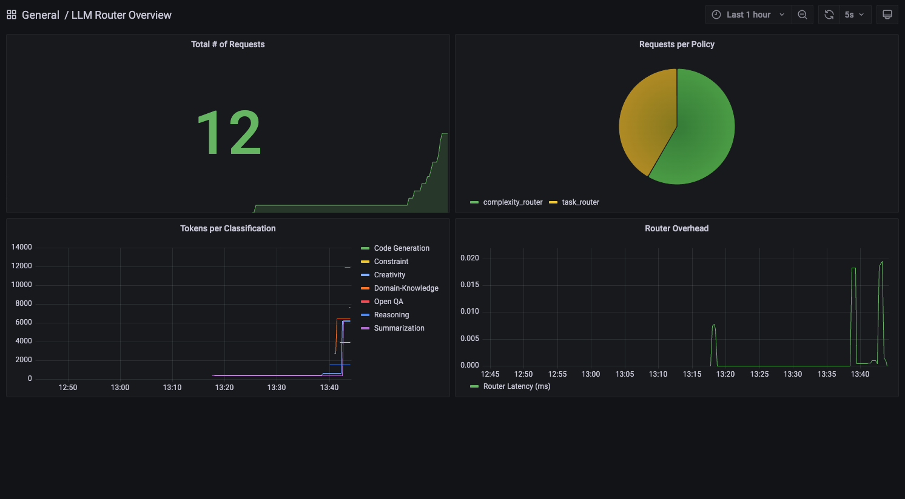

# Running a load test against LLM Router

One of the key capabilities of LLM router is performance. To aide in understanding this performance the router provides various metrics that can be used such as:

- request latency
- number of requests by model and policy
- llm response time

To see these metrics you can use the included prometheus and grafana components:

- `make metrics` will start grafana and prometheus
- access grafana at `localhost:3000` using the default username: `admin` and password: `secret` 
- click "add data source" and select prometheus, supplying the default prometheus url of `http://localhost:9090`
- run any number of requests through the LLM Router
- from the grafana home page click "explore" and you will be able to view the available metrics

While these metrics are a core part of LLM Router, this blueprint also includes a more complete load test. The load test:
- simulates simultaneous load against LLM Router
- tracks additional metrics captured by the load test client including model prompt tokens and completion tokens

To run the loadtest: 
- follow the instructions above including `make metrics`    
- run `make loadtest`
- navigate to the locust web application at `localhost:8089`
- enter the number of concurrent requests and hit begin

**TIP: The loadtest client requires multiple parallel threads in order to drive simulated traffic to the router. We recommend starting with 100 concurrent requests, though internal tests have shown router performance up to thousands of concurrent requests. If you are seeing a high error rate, check that the loadtest client - the machine where you ran `make loadtest` - has sufficient CPU and memory.**

The additional load and new metrics will be visible in Grafana, allowing you to compare the "expense" of different models for different prompts, and ultimately see the cost savings associated with using the router instead of sending all requests to the most expensive model. The metrics also demonstrate the <100ms overhead the router adds to each request.

Modifying the loadtest is possible by editing the values in `locustfile.py`. 