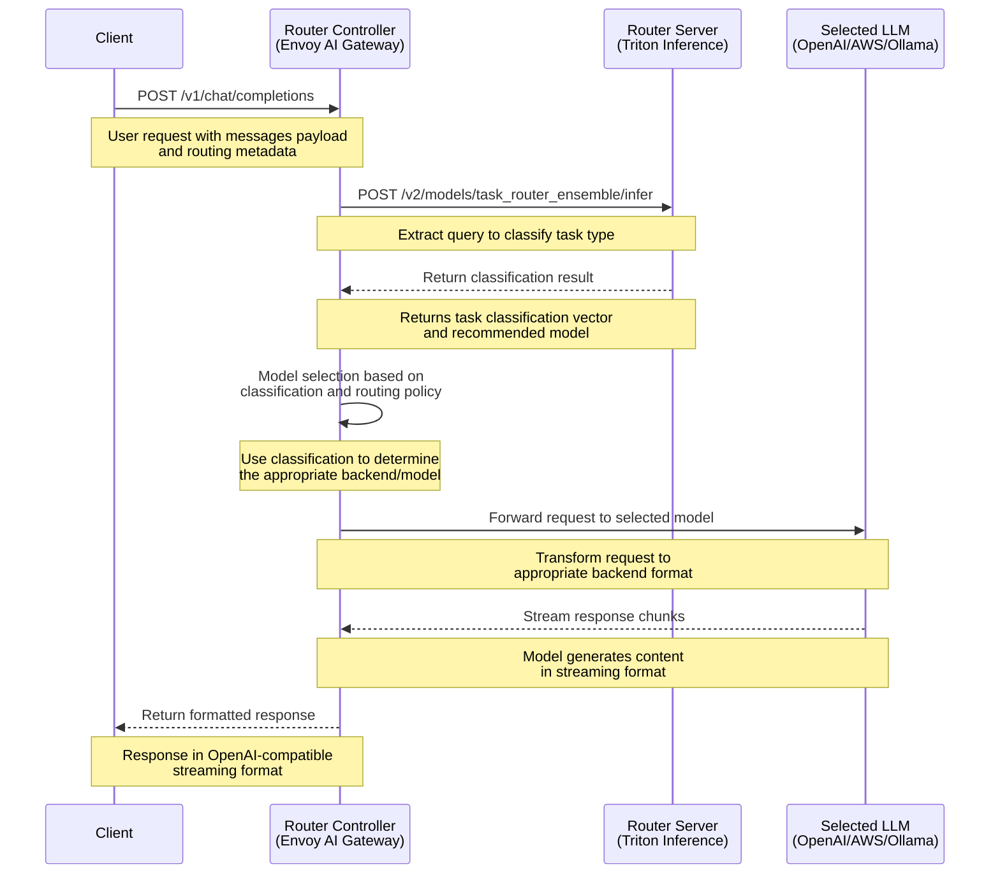

# LLM Router Request Processing Flow

The diagram below illustrates the request processing flow in the NVIDIA LLM Router system.



## Actual HTTP Requests/Responses

### 1. Client to Router Controller

```http
POST /v1/chat/completions HTTP/1.1
Host: 0.0.0.0:8084
User-Agent: curl/8.5.0
accept: application/json
Content-Type: application/json
Content-Length: 534

{
    "model": "",
    "messages": [
      {
        "role":"user",
        "content":"Hello! How are you?"
      },
      {
        "role":"assistant",
        "content":"Hi! I am quite well, how can I help you today?"
      },
      {
        "role":"user",
        "content":"Can you write me a song? Use as many emojis as possible."
      }
    ],
    "max_tokens": 64,
    "stream": true,
    "nim-llm-router": {"policy": "task_router",
                       "routing_strategy": "triton",
                       "model": ""}
}
```

### 2. Router Controller to Router Server (Triton)

```http
POST /v2/models/task_router_ensemble/infer HTTP/1.1
content-type: application/json
accept: */*
host: router-server:8000
content-length: 132

{"inputs":[{"name":"INPUT","datatype":"BYTES","shape":[1,1],"data":[["Can you write me a song? Use as many emojis as possible."]]}]}
```

### 3. Router Server to Router Controller

```http
HTTP/1.1 200 OK
Content-Type: application/json
Content-Length: 250

{"model_name":"task_router_ensemble","model_version":"1","parameters":{"sequence_id":0,"sequence_start":false,"sequence_end":false},"outputs":[{"name":"OUTPUT","datatype":"FP32","shape":[12],"data":[0.0,0.0,0.0,0.0,0.0,0.0,0.0,0.0,0.0,0.0,1.0,0.0]}]}
```

### 4. Router Controller to Client (Response Streaming)

```http
HTTP/1.1 200 OK
date: Thu, 15 May 2025 14:35:32 GMT
content-type: text/event-stream; charset=utf-8
transfer-encoding: chunked
connection: keep-alive
access-control-expose-headers: nvcf-reqid
nvcf-reqid: b85fb1a9-5995-41ce-87b1-8ba6296d7686
nvcf-status: fulfilled
server: uvicorn
vary: Origin
x-chosen-classifier: Text Generation

data: {"id":"chat-992b42a93afe4f51b29147dcb4720ae4","object":"chat.completion.chunk","created":1747319732,"model":"mistralai/mixtral-8x22b-instruct-v0.1","choices":[{"index":0,"delta":{"role":"assistant","content":null},"logprobs":null,"finish_reason":null}]}

data: {"id":"chat-992b42a93afe4f51b29147dcb4720ae4","object":"chat.completion.chunk","created":1747319732,"model":"mistralai/mixtral-8x22b-instruct-v0.1","choices":[{"index":0,"delta":{"role":null,"content":"Sure"},"logprobs":null,"finish_reason":null}]}

data: {"id":"chat-992b42a93afe4f51b29147dcb4720ae4","object":"chat.completion.chunk","created":1747319732,"model":"mistralai/mixtral-8x22b-instruct-v0.1","choices":[{"index":0,"delta":{"role":null,"content":","},"logprobs":null,"finish_reason":null}]}

... [additional streaming chunks] ...
```

## Request Flow Details

1. **Client Request:**
   - Client sends a POST request to `/v1/chat/completions` with a payload containing:
     - Messages array with conversation history
     - Model specification (optional)
     - Routing metadata in the `nim-llm-router` object
     - Other parameters like `max_tokens` and `stream`

2. **Task Classification:**
   - Router Controller extracts the last user message
   - Forwards it to the Router Server (Triton) for classification
   - Router Server runs inference on the `task_router_ensemble` model
   - Returns a classification vector indicating task type

3. **Model Selection:**
   - Based on classification results and routing policy
   - Selected according to rules in the AI Gateway configuration
   - Model can be determined by:
     - Explicit model name in request
     - Task classification (text generation, creative, etc.)
     - Routing strategy specified in request

4. **Response Processing:**
   - Selected model generates response
   - Router Controller transforms and streams the response
   - Client receives response in standard format

5. **Request Headers:**
   - Special headers like `aigw-backend-selector` can override routing
   - Model-specific headers control which backend is selected

This flow implements intelligent request routing to appropriate LLM backends based on task requirements, using NVIDIA's Triton Inference Server for classification and Envoy AI Gateway for routing.
